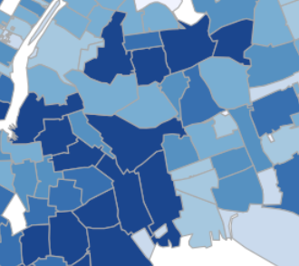

```{r, include=FALSE}
knitr::opts_chunk$set(
  results='asis', 
  echo = FALSE
)

library(glue)
library(tidyverse)

# Set this to true to have links turned into footnotes at the end of the document
PDF_EXPORT <- FALSE

# Holds all the links that were inserted for placement at the end
links <- c()

source('parsing_functions.R')

# Load csv with position info
position_data <- read_csv('positions.csv')
```


```{r}
# When in export mode the little dots are unaligned, so fix that. 
if(PDF_EXPORT){
  cat("
  <style>
  :root{
    --decorator-outer-offset-left: -6.5px;
  }
  </style>")
}
```


Aside
================================================================================


{width=100%}

```{r}
# When in export mode the little dots are unaligned, so fix that. 
if(PDF_EXPORT){
  cat("View this CV online with links at _nickstrayer.me/cv_")
} else {
  cat("[<i class='fas fa-download'></i> Download a PDF of this CV](https://github.com/nstrayer/cv/raw/master/strayer_cv.pdf)")
}
```

Contact {#contact}
--------------------------------------------------------------------------------


- <i class="fa fa-envelope"></i> tyleralexanderyoung@gmail
- <i class="fa fa-twitter"></i> Tylerisyoung
- <i class="fa fa-github"></i> github.com/tylerisyoung
- <i class="fa fa-link"></i> [www.tylerisyoung.com](http://www.tylerisyoung.com)
- <i class="fa fa-phone"></i> (555) 555-5555


Languages (Human&Digital) {#skills}
--------------------------------------------------------------------------------

```{r}
skills <- tribble(
  ~skill,               ~level,
  "English",            4.9,
  "Spanish",            3,
  "Adobe Suite",        4,
  "FCPX",               4.5,
  "ArcGis",             2.5,
  "R",                  2.5,
)

build_skill_bars(skills)
```


Disclaimer {#disclaimer}
--------------------------------------------------------------------------------

Made with the R package [**pagedown**](https://github.com/rstudio/pagedown). 

The source code is available at [github.com/nstrayer/cv](https://github.com/nstrayer/cv).

Last updated on `r Sys.Date()`.


Main
================================================================================

Tyler Young {#title}
--------------------------------------------------------------------------------


```{r}
intro_text <- "My name is Tyler, I’m an Environmentalist, a Journalist, and a Filmmaker. Currently in School for a masters in program evaluation & data analytics. I love prioritization science, effective altruism, beneficial business, storytelling through visual media, and I especially enjoy when my work can have a positive impact. I aim to make the world a better place through ***creativity for a greater good***. 
"

cat(sanitize_links(intro_text))
```


Education {data-icon=graduation-cap data-concise=true}
--------------------------------------------------------------------------------

```{r}
print_section(position_data, 'education')
```


Work Experience {data-icon=laptop}
--------------------------------------------------------------------------------

```{r}
print_section(position_data, 'work_experience')
```


Industry Experience {data-icon=suitcase}
--------------------------------------------------------------------------------


```{r}
print_section(position_data, 'industry_positions')
```

<br>
<br>
<br>


```{r, include=FALSE}
print_section(position_data, 'teaching_positions')
```


```{r, include=FALSE}
print_section(position_data, 'data_science_writings')
```


```{r, include=FALSE}
print_section(position_data, 'about_me_press')
```


```{r, include=FALSE}
print_section(position_data, 'by_me_press')
```


:::: aside
I have worked in a variety of roles including cowboy, astronaut, and crash test dummy. 
::::


```{r, include=FALSE}
print_section(position_data, 'academic_articles')
```


```{r}
if(PDF_EXPORT){
  cat("
  
Links {data-icon=link}
--------------------------------------------------------------------------------

<br>


")
  
  walk2(links, 1:length(links), function(link, index){
    print(glue('{index}. {link}'))
  })
}
```


